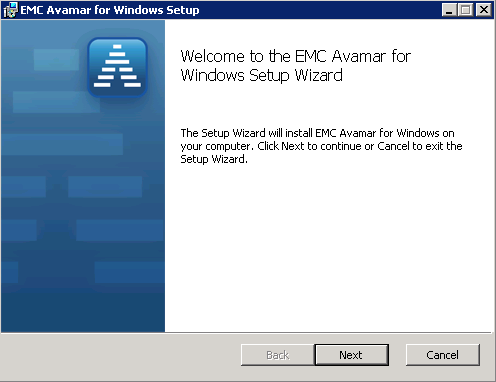
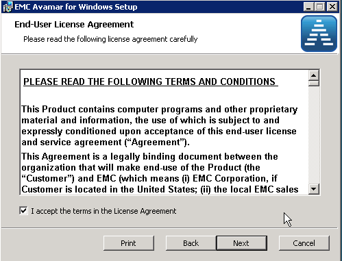
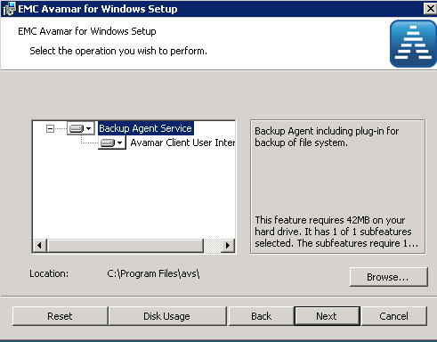
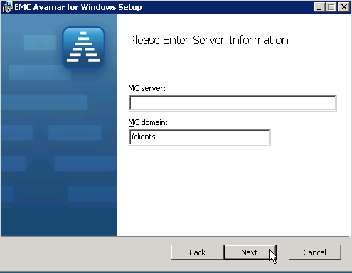
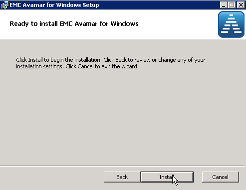
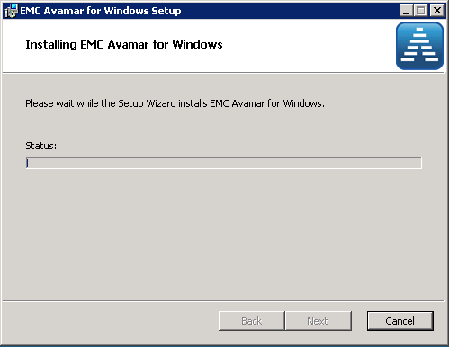
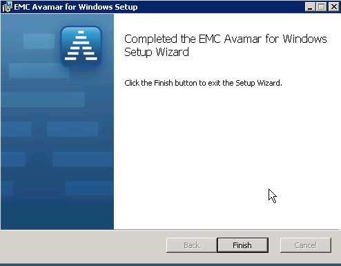

# Client Management

- [Activating A Client](#Activate-Client)
- [Retiring A Client](#Retire-Client)
- [Deleting A Client](#Delete-Client)

### Register client in Avamar Administrator

1. In Avamar Administrator, click the Administration launcher button.
The Administration window appears.
2. Click the Account Management tab.
In the Account Management tree, the icons for the clients indicate status. An x
appears for disabled clients, a question mark appears for unregistered clients, and
there is no special icon designation for active clients.
3. In the tree, select the domain for the new client.
4. From the Actions menu, select Account Management > New Client.
The New Client dialog box appears.
5. From the Client Type list, select Normal.
6. In the New Client Name field, type the client name.
7. (Optional) Type the client contact name, telephone number, email address, and
location in the remaining fields of the New Client dialog box.
8. Click OK.
A confirmation message appears.
9. Click OK.

### Install Windows Client

### Activating a client

Client activation is the process of passing the client ID (CID) back to the client, where it is
stored in a file on the client file system.

##### Before you begin

- The client must be present on the network.
- The Avamar client software must be installed and running on the client.
- The Avamar server must be able to resolve the hostname that was used to register the
client.

##### There are two ways to activate a client:

- Initiate activation from the client. The EMC Avamar Backup Clients User Guide describes
this method.
- Invite the client to activate with the server by using Avamar Administrator.

NOTICE

HP-UX, Linux, and Solaris clients can either be activated during installation or by using
Avamar Administrator. There is no client-side command to initiate client activation on
these computing platforms.

Procedure

1. In Avamar Administrator, click the Administration launcher button.
The Administration window appears.
2. Click the Account Management tab.
In the Account Management tree, the icons for the clients indicate status. An x
appears for disabled clients, a question mark appears for unregistered clients, and
there is no special icon designation for active clients.
3. In the tree, select the client to activate.
4. From the Actions menu, select Account Management > Invite Client.
A status message indicates that the client was sent an invitation to activate with the
server.
5. Click OK.

- Once this is complete, the client should be in the Avamar Administrator

### Retiring a client

When you retire a client, Avamar stops running backups of the client. Avamar uses the
specified retention setting for the existing backups of a retired client to determine how
long to retain the existing backups. Avamar also uses the specified retention setting for
existing replicas of a retired client's backups to determine how long to retain the existing
replicas.

To restore data from existing backups or replicas of a retired client, use Avamar
Administrator.

1. In Avamar Administrator, click the Administration launcher button.
The Administration window appears.
2. Click the Account Management tab.
In the Account Management tree, the icons for the clients indicate status. An X
appears for disabled clients, a question mark appears for unregistered clients, and
there is no special icon designation for active clients.
3. In the tree, select the client to retire.
4. From the Actions menu, select Account Management > Retire Client.
The Retire Client dialog box appears.
5. In the Local Backups section, choose how long to keep backups for the client:
l To keep backups until their existing expiration dates, select Retain local backups
with existing expiration date.
l To keep backups indefinitely, regardless of the existing expiration dates, select
Retain all local backups indefinitely.
l To keep backups until a new expiration date, select Reset local backup expiration
date and in New Expiration Date, select a new date.
6. (Client with replicas) In the Remote Backups section, choose how long to keep
replicas for the client:
- To keep replicas until their existing expiration dates, select Retain remote backups
with existing expiration date.
- To keep replicas indefinitely, regardless of the existing expiration dates, select
Retain all remote backups indefinitely.
- To keep replicas until a new expiration date, select Reset remote backup
expiration date and in New Expiration Date, select a new date.
7. Click OK.
A confirmation message appears.
8. Click Yes.

### Deleting a Client (and all it's backups)

Delete a client and all backups of the client. Optionally, choose to delete all replicas that
existing on replication destination systems.

When you delete a client, Avamar permanently deletes all backups that are stored for that
client. Only delete a client when you are certain that there is no reason to retain the
backups. If there is any doubt, retire the client instead.
Procedure

1. In Avamar Administrator, click the Administration launcher button.
The Administration window appears.
2. Click the Account Management tab.
In the Account Management tree, the icons for the clients indicate status. An X
appears for disabled clients, a question mark appears for unregistered clients, and
there is no special icon designation for active clients.
3. In the tree, select the client to delete.
4. From the Actions menu, select Account Management > Delete Client.
The Delete Client dialog box appears and displays the number of existing backups for
the client.
5. (Clients with replicas) Choose how to handle the client's replicas:
l To delete all replicas for the client, select Also delete remote backups on external
servers.
l To retain all replicas for the client, clear Also delete remote backups on external
servers.
6. Select I understand this action is permanent and irreversible.
This field is a safety net to avoid unintentionally deleting a client and the client's
backups.
7. Click Delete.
